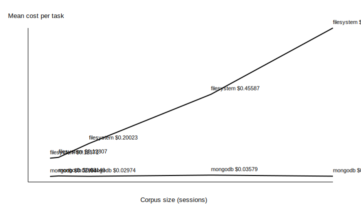
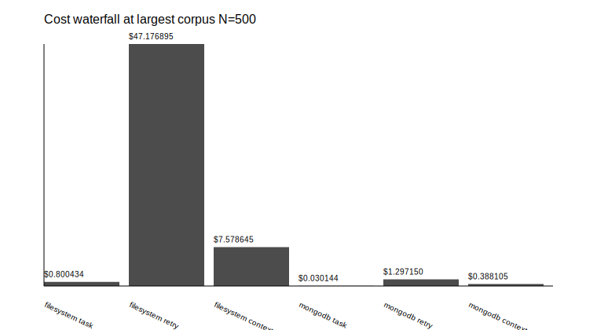
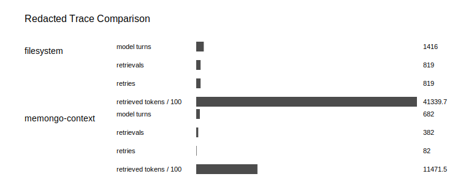

# Results

Same task. Same model. Different memory architecture.

## Best Balanced Point: N=100

| Metric | Filesystem | memongo-context | Result |
|---|---:|---:|---:|
| Accuracy | 68.3% | 63.3% | -5.0 pp |
| Cost per correct answer | $0.313525 | $0.066253 | 4.7x cheaper |
| Mean input tokens / task | 40,804 | 7,099 | 82.6% fewer |
| p50 latency | 9.3s | 6.5s | faster |

This is the cleanest economic signal: near-parity outcome quality with a large cost-per-correct-answer improvement.

## Scaling Cliff: N=500

| Metric | Filesystem | memongo-context | Result |
|---|---:|---:|---:|
| Mean cost / task | $0.689078 | $0.048234 | 14.29x cheaper |
| Cost per correct answer | $1.060120 | $0.099794 | 10.6x cheaper |
| Mean input tokens / task | 134,705 | 8,074 | 126,631 fewer |
| Accuracy | 65.0% | 48.3% | -16.7 pp |

At the largest corpus, memongo dramatically reduces token drag. The accuracy gap is real and should be treated as the next retrieval-quality target, not hidden.

## Visuals

## Interpretation

Filesystem memory keeps quality competitive by reading large chunks of context. That becomes expensive as memory grows. `memongo-context` keeps context bounded, reducing retry-tail and context-inflation tokens, but still needs recall improvements on the hardest multi-session and temporal tasks.

The benchmark is strongest when read as token-to-outcome evidence: it shows where memory architecture converts inference spend into useful work, and where retrieval quality still leaks outcomes.

## Published Artifacts

Public artifacts include aggregate metrics, redacted traces, task IDs, checksums, exact commands, and memongo sidecar provenance. Raw LongMemEval-S text and private traces are excluded.

Claims should reference the exact run ID and matrix in `public-artifacts/latest/run-manifest.json`, including the observed accuracy tradeoff and recorded provider failures.
